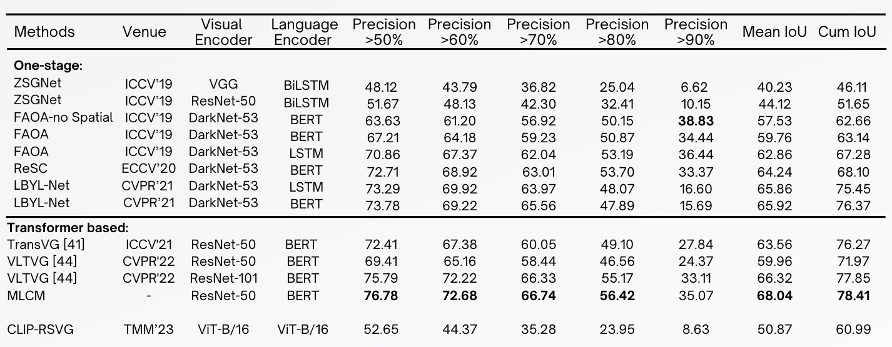

# Localisation d’objets conditionnée par le texte
<p align="center">  </p>
CLIP for Visual Grounding.

This repository is the fine tuning of the method proposed in the paper [**CLIP-VG: Self-paced Curriculum Adapting of CLIP 
for Visual Grounding**](https://ieeexplore.ieee.org/abstract/document/10269126). 
For Visual grounding on remote sensing images

## Contents

1. [Introduction](#introduction)
2. [Usage](#usage)
3. [Results](#results)
4. [Acknowledgments](#acknowledgments)

## Introduction

Object localization conditioned by text involves identifying precise objects in an image based on corresponding textual descriptions. This task has significant applications in fields like augmented reality and video surveillance. This project explores using transformers to integrate textual and visual information for accurate object localization. The approach is evaluated on dataset DIOR-RSVG and compared with other reference approaches.

## Usage
### Dependencies
- Python 3.9.10
- PyTorch 1.9.0 + cu111 + cp39
- Check [requirements.txt](requirements.txt) for other dependencies. 


### Image Data Preparation
1.You can download the images from the original source and place them in your disk folder, such as `$/path_to_image_data`:
- [DIOR-RSVG](https://drive.google.com/drive/folders/1hTqtYsC6B-m4ED2ewx5oKuYZV13EoJp_)


<table>
  <tr>
    <th>Dataset</th>
    <th>Training Set (~70%)</th>
    <th>Validation Set (~10%)</th>
    <th>Test Set (~20%)</th>
    <th>Total</th>
  </tr>
  <tr>
    <td>DIOR-RSVG</td>
    <td>26991</td>
    <td>3829</td>
    <td>7500</td>
    <td>38320</td>
  </tr>
</table>


## Training and Evaluation


- `CUDA_VISIBLE_DEVICES=0`: Specifies the GPU to be used for training.
- `--nproc_per_node=1`: Number of processes per node, typically set to 1 for single GPU training.
- `--master_port 28887`: Port for communication in distributed training.
- `--use_env`: Use environment variables for configuration.
- `--num_workers 2`: Number of worker threads for data loading.
- `--epochs 110`: Number of training epochs.
- `--batch_size 64`: Batch size for training.
- `--lr 0.00005`: Learning rate.
- `--lr_scheduler cosine`: Learning rate scheduler type.
- `--aug_crop`, `--aug_scale`, `--aug_translate`: Data augmentation techniques to be applied.
- `--imsize 224`: Input image size.
- `--max_query_len 77`: Maximum length of the query text.
- `--dataset dior_rs`: Specifies the dataset to be used.
- `--vl_nheads 16`: Number of attention heads in the model.
- `--data_root /content/`: Root directory of the dataset.
- `--split_root /content/drive/MyDrive/unsup_multi_source_msa`: Directory for dataset splits.
- `--resume /content/drive/MyDrive/test/dior_rs/checkpoint.pth`: Path to a checkpoint file to resume training.
- `--output_dir /content/drive/MyDrive/test/dior_rs`: Directory to save training outputs.

For training using Colab, use the file  [train_colab.ipynb](train_colab.ipynb) and follow the instructions in the notebook.
change the path to the dataset in the notebook to the path where you have stored the dataset. (Preferably in your google drive)

### Training Example
<p align="center">  </p>

### Evaluation Example
Run the following command to evaluate the model on the test set:
```bash eval.sh```
If you want you can visualize some examples just change the code used in eval.sh from eval.py to visualize_example.py


## Results

The model is evaluated on the DIOR-RSVG dataset. 

<p align="center">  </p>

## Acknowledgement
Model used is from the repository [CLIP-VG](https://github.com/linhuixiao/CLIP-VG)

The model is related to [CLIP](https://github.com/openai/CLIP), [Pseudo-Q](https://github.com/LeapLabTHU/Pseudo-Q), [TransVG](https://github.com/linhuixiao/TransVG). Thanks for their great work!

We also thank the great previous work including [DETR](https://github.com/facebookresearch/detr), [QRNet](https://github.com/LukeForeverYoung/QRNet), [M2](https://github.com/aimagelab/meshed-memory-transformer), [CLIPCap](https://github.com/rmokady/CLIP_prefix_caption), [RelTR](https://github.com/yrcong/RelTR), [bottom-up-attention](https://github.com/peteanderson80/bottom-up-attention), [ReSC](https://github.com/zyang-ur/ReSC), etc. 

Thanks [OpenAI](https://github.com/openai) for their awesome models.


